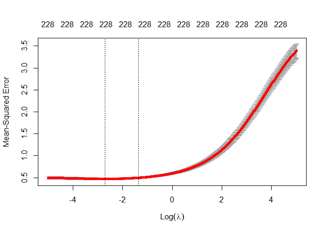
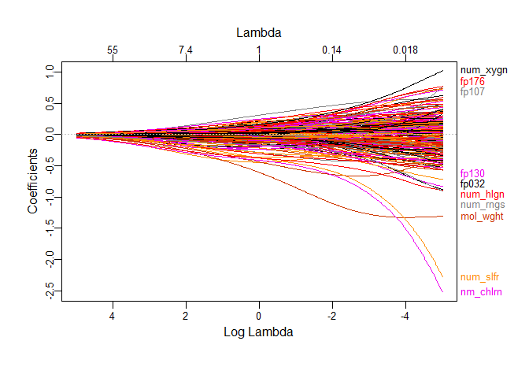
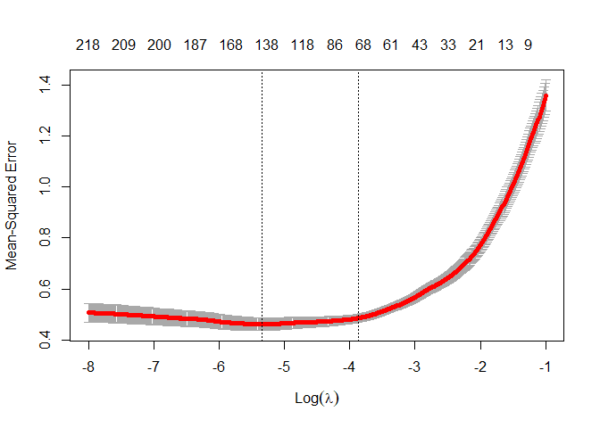
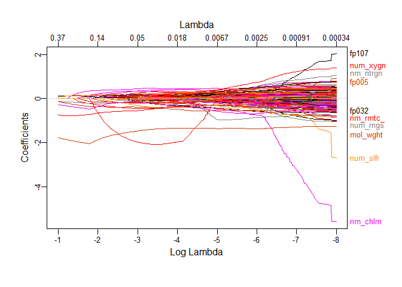
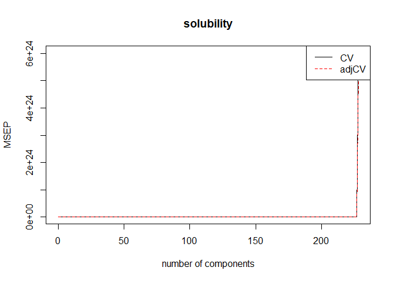

p8106-hw1
================
xinran
2/25/2020

# Import data

``` r
train_data = read.csv("./data/solubility_train.csv") %>% 
  janitor::clean_names()
test_data = read.csv("./data/solubility_test.csv") %>% 
  janitor::clean_names()
```

# (a) Fit a linear model using least squares on the training data and calculate the mean square error using the test data.

## Fit linear model on the training data

``` r
fit_lm_tr = lm(solubility ~ .， data = train_data)
sm=summary(fit_lm_tr)
```

## Calculate the mean square error using the test data

``` r
pred_lm_tr = predict(fit_lm_tr, test_data)
mse_test = mean((pred_lm_tr - test_data$solubility)^2);
```

# (b) Fit a ridge regression model on the training data, with λ chosen by cross-validation. Report the test error

``` r
set.seed(1)
train_data = na.omit(train_data)
x = model.matrix(solubility ~ ., train_data)[, -1]
y = train_data$solubility

ridge_mod = glmnet(x, y, standardize= T, 
                   alpha = 0, 
                   lambda = exp(seq(-5, 5, length = 500)))
mat_coef = coef(ridge_mod)
dim(mat_coef)
```

    ## [1] 229 500

``` r
# Cross-validation
cv_ridge = cv.glmnet(x, y,type.measure = "mse",
                     alpha = 0,
                     lambda = exp(seq(-5, 5, length = 500)))
plot(cv_ridge)
```

<!-- -->

``` r
# Trace plot
plot_glmnet(ridge_mod, xvar = "rlambda",label=10)
```

<!-- -->

``` r
# Coefficients of the final model
best_lambda = cv_ridge$lambda.min
best_lambda
```

    ## [1] 0.06617643

``` r
pred_resp_ridge = predict(ridge_mod, newx = model.matrix(solubility ~ ., test_data)[, -1], s = best_lambda, type = "response"); pred_resp_ridge
```

    ##                1
    ## 1    0.483167756
    ## 2    0.120348521
    ## 3   -0.526900417
    ## 4    0.769027145
    ## 5    0.043332289
    ## 6    1.478864178
    ## 7    0.590728055
    ## 8    0.438705587
    ## 9    0.545609999
    ## 10  -0.608398226
    ## 11  -0.490551208
    ## 12  -1.446749274
    ## 13   0.219012043
    ## 14  -0.117506759
    ## 15  -0.813120331
    ## 16  -0.806422447
    ## 17  -0.280568592
    ## 18   0.125811417
    ## 19   0.521923706
    ## 20  -0.906450329
    ## 21   0.434697889
    ## 22  -0.217228257
    ## 23  -0.638386853
    ## 24  -0.528196716
    ## 25  -1.088004465
    ## 26  -0.190990099
    ## 27  -0.562645866
    ## 28   1.071573627
    ## 29  -1.862310019
    ## 30  -1.104384075
    ## 31  -2.368945196
    ## 32  -0.847824891
    ## 33  -0.739653625
    ## 34  -0.037616120
    ## 35  -0.029009671
    ## 36  -1.116401898
    ## 37   0.427672805
    ## 38  -0.716850693
    ## 39   0.088780818
    ## 40  -0.898465409
    ## 41  -0.687718922
    ## 42  -2.194848618
    ## 43  -1.142000830
    ## 44  -0.005627178
    ## 45  -1.663875099
    ## 46  -0.926631812
    ## 47  -0.755002937
    ## 48  -0.951278553
    ## 49  -0.809108642
    ## 50  -0.846116255
    ## 51  -0.039621104
    ## 52  -1.482672845
    ## 53  -1.522785336
    ## 54  -1.404699072
    ## 55  -1.872078572
    ## 56  -1.358347996
    ## 57  -1.277319150
    ## 58  -1.572751668
    ## 59  -1.837669865
    ## 60  -1.843131397
    ## 61  -0.997060682
    ## 62  -1.361939958
    ## 63  -1.199416413
    ## 64  -1.228500861
    ## 65  -1.260081131
    ## 66  -1.897903365
    ## 67  -2.842673783
    ## 68  -1.970594623
    ## 69  -1.436493517
    ## 70  -2.953377243
    ## 71  -2.145067390
    ## 72  -2.658845730
    ## 73  -1.795274003
    ## 74  -3.125910357
    ## 75  -1.987203065
    ## 76  -2.723985472
    ## 77  -2.596868649
    ## 78  -2.055636742
    ## 79  -1.773777503
    ## 80  -2.282298916
    ## 81  -1.129058916
    ## 82  -1.676123202
    ## 83  -2.270474821
    ## 84  -2.031877659
    ## 85  -1.086220515
    ## 86  -1.513151329
    ## 87  -3.145252500
    ## 88  -2.305489152
    ## 89  -2.118608931
    ## 90  -2.302975527
    ## 91  -1.782255027
    ## 92  -2.179318800
    ## 93  -2.531916967
    ## 94  -1.678040536
    ## 95  -0.546895840
    ## 96  -2.375993846
    ## 97  -1.852769913
    ## 98  -2.258695593
    ## 99  -1.535778607
    ## 100 -2.054717680
    ## 101 -2.035391746
    ## 102 -2.209873123
    ## 103 -2.078294152
    ## 104 -2.382881668
    ## 105 -2.720933425
    ## 106 -2.088193893
    ## 107 -2.354352409
    ## 108 -2.454536197
    ## 109 -3.127736869
    ## 110 -3.252391222
    ## 111 -2.713561777
    ## 112 -3.143711997
    ## 113 -3.081523895
    ## 114 -3.145221125
    ## 115 -2.725744752
    ## 116 -2.591979826
    ## 117 -2.810463612
    ## 118 -2.456630757
    ## 119 -2.924375192
    ## 120 -2.884055615
    ## 121 -2.386771024
    ## 122 -1.295775234
    ## 123 -3.625267098
    ## 124 -2.942760942
    ## 125 -2.889822586
    ## 126 -2.817591424
    ## 127 -3.572806893
    ## 128 -3.075350474
    ## 129 -3.555186808
    ## 130 -2.853046715
    ## 131 -3.044785057
    ## 132 -3.605014554
    ## 133 -2.412340719
    ## 134 -3.668199834
    ## 135 -2.450725864
    ## 136 -3.439097960
    ## 137 -2.543797951
    ## 138 -2.976849577
    ## 139 -2.851334505
    ## 140 -2.344274692
    ## 141 -2.816373245
    ## 142 -2.050963922
    ## 143 -3.538737915
    ## 144 -2.702359523
    ## 145 -3.144700802
    ## 146 -3.475556759
    ## 147 -2.684642504
    ## 148 -3.177984911
    ## 149 -3.508854068
    ## 150 -3.690459657
    ## 151 -1.957852878
    ## 152 -3.177308434
    ## 153 -2.447864055
    ## 154 -3.754974620
    ## 155 -2.983942455
    ## 156 -3.124889479
    ## 157 -4.407244391
    ## 158 -5.017285859
    ## 159 -3.923457838
    ## 160 -4.267511510
    ## 161 -5.505286223
    ## 162 -4.156042079
    ## 163 -3.283566409
    ## 164 -4.639476861
    ## 165 -4.956580579
    ## 166 -3.522095573
    ## 167 -4.679778378
    ## 168 -4.068406963
    ## 169 -4.789340053
    ## 170 -4.581644291
    ## 171 -3.757616990
    ## 172 -3.711984985
    ## 173 -3.540103909
    ## 174 -4.884921016
    ## 175 -4.873734302
    ## 176 -4.061177085
    ## 177 -3.938392111
    ## 178 -4.704097070
    ## 179 -4.404302940
    ## 180 -3.109584180
    ## 181 -4.777975033
    ## 182 -3.775200474
    ## 183 -4.683151879
    ## 184 -4.398928505
    ## 185 -3.936285221
    ## 186 -3.830010198
    ## 187 -4.644743165
    ## 188 -4.964978003
    ## 189 -6.055007154
    ## 190 -5.903407111
    ## 191 -4.368670948
    ## 192 -2.919002546
    ## 193 -4.437564590
    ## 194 -4.796083761
    ## 195 -4.491063266
    ## 196 -4.477868367
    ## 197 -5.657141862
    ## 198 -4.425713616
    ## 199 -4.969992981
    ## 200 -5.287914475
    ## 201 -7.295405225
    ## 202 -6.509629216
    ## 203 -6.266047795
    ## 204 -6.756537056
    ## 205 -5.840793590
    ## 206 -5.831437670
    ## 207 -5.577101304
    ## 208 -5.820972528
    ## 209 -6.893739831
    ## 210 -6.753958536
    ## 211 -7.183896803
    ## 212 -7.002099078
    ## 213 -7.667381047
    ## 214 -7.893062688
    ## 215 -8.517962551
    ## 216 -7.611605543
    ## 217 -0.012825616
    ## 218  0.389732012
    ## 219  0.280582698
    ## 220 -0.118201736
    ## 221 -1.154873024
    ## 222 -0.573962826
    ## 223 -0.935935321
    ## 224 -0.952845038
    ## 225 -2.207491497
    ## 226 -0.883795924
    ## 227 -0.894410532
    ## 228 -0.979240350
    ## 229 -0.477983538
    ## 230 -1.802061322
    ## 231 -1.467378259
    ## 232 -1.442153309
    ## 233 -0.856037553
    ## 234 -0.030896279
    ## 235 -1.459200373
    ## 236 -1.016499710
    ## 237 -3.405641531
    ## 238 -1.640906027
    ## 239 -1.522785336
    ## 240 -1.357808472
    ## 241 -0.566891923
    ## 242 -2.021459340
    ## 243 -1.580486399
    ## 244 -2.339578432
    ## 245 -1.400627463
    ## 246 -0.553345069
    ## 247 -1.438330504
    ## 248 -1.120614172
    ## 249 -1.007756850
    ## 250 -2.144870661
    ## 251 -1.893069440
    ## 252 -2.121182874
    ## 253 -2.504158292
    ## 254 -3.518913344
    ## 255 -2.506865182
    ## 256 -0.996334030
    ## 257 -1.648481835
    ## 258 -1.674181460
    ## 259 -4.302423970
    ## 260 -1.445243333
    ## 261 -2.291602739
    ## 262 -2.375324272
    ## 263 -2.785781635
    ## 264 -3.136885853
    ## 265 -2.382043414
    ## 266 -1.465863252
    ## 267 -2.517278155
    ## 268 -2.157756829
    ## 269 -2.727440831
    ## 270 -2.900266766
    ## 271 -2.715346548
    ## 272 -3.451395890
    ## 273 -3.399079449
    ## 274 -3.682221435
    ## 275 -2.876708038
    ## 276 -3.563850721
    ## 277 -3.579869715
    ## 278 -2.713775142
    ## 279 -3.646609656
    ## 280 -3.160374709
    ## 281 -2.363372391
    ## 282 -3.887819771
    ## 283 -3.604591018
    ## 284 -3.832995387
    ## 285 -3.993706549
    ## 286 -4.355517279
    ## 287 -3.359779473
    ## 288 -3.051254856
    ## 289 -4.180755466
    ## 290 -5.005727363
    ## 291 -4.461275664
    ## 292 -4.334690565
    ## 293 -3.249393322
    ## 294 -4.599149686
    ## 295 -4.265620004
    ## 296 -4.013269895
    ## 297 -4.174398629
    ## 298 -3.923256020
    ## 299 -5.033097619
    ## 300 -5.659974614
    ## 301 -5.427538873
    ## 302 -5.334818091
    ## 303 -6.414739289
    ## 304 -5.542208568
    ## 305 -5.687608863
    ## 306 -6.928879187
    ## 307 -7.423799626
    ## 308 -8.110204580
    ## 309 -8.122797469
    ## 310 -8.437923456
    ## 311 -8.902478354
    ## 312 -7.168782010
    ## 313 -2.031000582
    ## 314 -2.642341349
    ## 315 -4.652387166
    ## 316 -4.342064431

``` r
# MSE
mse_ridge=mse(test_data$solubility, pred_resp_ridge)
```

Based on the result, the MSE for ridge regression is
0.5123393.

# (c) Fit a lasso model on the training data, with λ chosen by cross-validation. Report the test error, along with the number of non-zero coefficient estimates.

``` r
set.seed(1)
cv_lasso = cv.glmnet(x, y, alpha = 1, lambda = exp(seq(-8, -1, length = 500)))

# Cross-validation
plot(cv_lasso)
```

<!-- -->

``` r
cv_lasso$lambda.min
```

    ## [1] 0.00475434

``` r
# Trace plot
plot_glmnet(cv_lasso$glmnet.fit)
```

<!-- -->

``` r
# Predict response in the final model
pred_resp_lasso=predict(cv_lasso,newx = model.matrix(solubility ~ ., test_data)[, -1],s = cv_lasso$lambda.min, type = "response")

# MSE
mse_lasso=mse(test_data$solubility, pred_resp_lasso)
# Number of non-zero coefficient estimates
dim(as.matrix(predict(cv_lasso, s = "lambda.min", type = "coefficients")@x))
```

    ## [1] 142   1

Thus, we know the MSE for lasso model is 0.4985083, and the number of
non-zero coefficient estimates is
142.

# (d) Fit a principle component regression model on the training data, with M chosen by cross-validation. Report the test error, along with the value of M selected by cross-validation.

## Fit PCR model on training data

``` r
set.seed(1)
pcr_mod = pcr(solubility ~ .,
              data = train_data，
              scale = T,
              validation = "CV")
summary(pcr_mod)
```

    ## Data:    X dimension: 951 228 
    ##  Y dimension: 951 1
    ## Fit method: svdpc
    ## Number of components considered: 228
    ## 
    ## VALIDATION: RMSEP
    ## Cross-validated using 10 random segments.
    ##        (Intercept)  1 comps  2 comps  3 comps  4 comps  5 comps  6 comps
    ## CV           2.048    2.044    1.979    1.712    1.605    1.582    1.451
    ## adjCV        2.048    2.044    1.978    1.711    1.602    1.618    1.450
    ##        7 comps  8 comps  9 comps  10 comps  11 comps  12 comps  13 comps
    ## CV       1.301    1.295    1.295     1.277     1.254     1.248     1.243
    ## adjCV    1.297    1.292    1.294     1.276     1.249     1.246     1.243
    ##        14 comps  15 comps  16 comps  17 comps  18 comps  19 comps
    ## CV        1.198     1.181     1.120     1.062     1.051     1.040
    ## adjCV     1.197     1.183     1.117     1.054     1.049     1.038
    ##        20 comps  21 comps  22 comps  23 comps  24 comps  25 comps
    ## CV        1.019     1.008     1.007    0.9778    0.9785    0.9757
    ## adjCV     1.012     1.006     1.007    0.9742    0.9759    0.9742
    ##        26 comps  27 comps  28 comps  29 comps  30 comps  31 comps
    ## CV       0.9695    0.9683    0.9637    0.9661    0.9665    0.9468
    ## adjCV    0.9661    0.9663    0.9629    0.9645    0.9673    0.9438
    ##        32 comps  33 comps  34 comps  35 comps  36 comps  37 comps
    ## CV       0.9310    0.9192    0.9202    0.9023    0.8882    0.8802
    ## adjCV    0.9285    0.9159    0.9188    0.9004    0.8854    0.8768
    ##        38 comps  39 comps  40 comps  41 comps  42 comps  43 comps
    ## CV       0.8814    0.8828    0.8724    0.8709    0.8715    0.8657
    ## adjCV    0.8784    0.8838    0.8688    0.8684    0.8702    0.8659
    ##        44 comps  45 comps  46 comps  47 comps  48 comps  49 comps
    ## CV       0.8515    0.8495    0.8519    0.8451    0.8446    0.8441
    ## adjCV    0.8491    0.8458    0.8489    0.8420    0.8420    0.8415
    ##        50 comps  51 comps  52 comps  53 comps  54 comps  55 comps
    ## CV       0.8436    0.8401    0.8351    0.8326    0.8328    0.8323
    ## adjCV    0.8419    0.8386    0.8305    0.8297    0.8295    0.8297
    ##        56 comps  57 comps  58 comps  59 comps  60 comps  61 comps
    ## CV       0.8334    0.8304    0.8273    0.8255    0.8219    0.8103
    ## adjCV    0.8309    0.8313    0.8295    0.8242    0.8205    0.8027
    ##        62 comps  63 comps  64 comps  65 comps  66 comps  67 comps
    ## CV       0.8085    0.8114    0.8103    0.8111    0.8157    0.8104
    ## adjCV    0.8023    0.8063    0.8067    0.8076    0.8133    0.8070
    ##        68 comps  69 comps  70 comps  71 comps  72 comps  73 comps
    ## CV       0.8110    0.8088    0.8081    0.8069    0.7986    0.7993
    ## adjCV    0.8084    0.8055    0.8052    0.8061    0.7922    0.7933
    ##        74 comps  75 comps  76 comps  77 comps  78 comps  79 comps
    ## CV       0.7972    0.7967    0.7950    0.7934    0.7936    0.7895
    ## adjCV    0.7917    0.7922    0.7911    0.7904    0.7908    0.7855
    ##        80 comps  81 comps  82 comps  83 comps  84 comps  85 comps
    ## CV       0.7905    0.7903    0.7932    0.7952    0.7944    0.7932
    ## adjCV    0.7871    0.7875    0.7881    0.7918    0.7915    0.7884
    ##        86 comps  87 comps  88 comps  89 comps  90 comps  91 comps
    ## CV       0.7929    0.7935    0.7934    0.7921    0.7883    0.7875
    ## adjCV    0.7885    0.7903    0.7906    0.7902    0.7861    0.7829
    ##        92 comps  93 comps  94 comps  95 comps  96 comps  97 comps
    ## CV       0.7865    0.7861    0.7834    0.7812    0.7802    0.7833
    ## adjCV    0.7794    0.7790    0.7769    0.7756    0.7749    0.7791
    ##        98 comps  99 comps  100 comps  101 comps  102 comps  103 comps
    ## CV        0.784    0.7850     0.7816     0.7759     0.7758     0.7695
    ## adjCV     0.780    0.7818     0.7751     0.7707     0.7709     0.7660
    ##        104 comps  105 comps  106 comps  107 comps  108 comps  109 comps
    ## CV        0.7658     0.7647     0.7651     0.7661     0.7668     0.7647
    ## adjCV     0.7598     0.7593     0.7603     0.7617     0.7635     0.7572
    ##        110 comps  111 comps  112 comps  113 comps  114 comps  115 comps
    ## CV        0.7665     0.7636     0.7602     0.7627     0.7639     0.7665
    ## adjCV     0.7596     0.7577     0.7554     0.7584     0.7592     0.7626
    ##        116 comps  117 comps  118 comps  119 comps  120 comps  121 comps
    ## CV        0.7657     0.7668     0.7648     0.7624      0.762     0.7597
    ## adjCV     0.7607     0.7626     0.7636     0.7611      0.761     0.7529
    ##        122 comps  123 comps  124 comps  125 comps  126 comps  127 comps
    ## CV        0.7579     0.7572     0.7568     0.7548      0.749     0.7489
    ## adjCV     0.7531     0.7527     0.7521     0.7466      0.742     0.7435
    ##        128 comps  129 comps  130 comps  131 comps  132 comps  133 comps
    ## CV        0.7482     0.7482     0.7433     0.7367     0.7375     0.7374
    ## adjCV     0.7443     0.7429     0.7410     0.7289     0.7282     0.7287
    ##        134 comps  135 comps  136 comps  137 comps  138 comps  139 comps
    ## CV        0.7343     0.7294     0.7282     0.7303     0.7282     0.7280
    ## adjCV     0.7276     0.7247     0.7216     0.7240     0.7224     0.7224
    ##        140 comps  141 comps  142 comps  143 comps  144 comps  145 comps
    ## CV        0.7276     0.7208     0.7206     0.7174     0.7156     0.7121
    ## adjCV     0.7219     0.7139     0.7154     0.7147     0.7059     0.7048
    ##        146 comps  147 comps  148 comps  149 comps  150 comps  151 comps
    ## CV        0.7117     0.7085     0.7082     0.7066     0.7061     0.7081
    ## adjCV     0.7038     0.7014     0.6993     0.6990     0.6980     0.7008
    ##        152 comps  153 comps  154 comps  155 comps  156 comps  157 comps
    ## CV        0.7055     0.7071     0.7106     0.7114     0.7102     0.7106
    ## adjCV     0.6985     0.7001     0.7043     0.7034     0.7030     0.7020
    ##        158 comps  159 comps  160 comps  161 comps  162 comps  163 comps
    ## CV        0.7086     0.7096     0.7104     0.7114     0.7106     0.7125
    ## adjCV     0.7001     0.7018     0.7027     0.7031     0.7029     0.7057
    ##        164 comps  165 comps  166 comps  167 comps  168 comps  169 comps
    ## CV        0.7138     0.7153     0.7162     0.7145     0.7154     0.7147
    ## adjCV     0.7059     0.7078     0.7073     0.7062     0.7072     0.7069
    ##        170 comps  171 comps  172 comps  173 comps  174 comps  175 comps
    ## CV        0.7146     0.7167     0.7188     0.7191     0.7169     0.7143
    ## adjCV     0.7065     0.7085     0.7107     0.7116     0.7085     0.7066
    ##        176 comps  177 comps  178 comps  179 comps  180 comps  181 comps
    ## CV        0.7185     0.7188     0.7156     0.7169     0.7157     0.7161
    ## adjCV     0.7095     0.7096     0.7075     0.7089     0.7081     0.7071
    ##        182 comps  183 comps  184 comps  185 comps  186 comps  187 comps
    ## CV        0.7188     0.7183     0.7182     0.7176     0.7184     0.7211
    ## adjCV     0.7103     0.7088     0.7096     0.7090     0.7083     0.7115
    ##        188 comps  189 comps  190 comps  191 comps  192 comps  193 comps
    ## CV        0.7234     0.7241     0.7248     0.7242     0.7276     0.7298
    ## adjCV     0.7138     0.7146     0.7154     0.7151     0.7186     0.7207
    ##        194 comps  195 comps  196 comps  197 comps  198 comps  199 comps
    ## CV        0.7338     0.7331     0.7312     0.7334     0.7329     0.7384
    ## adjCV     0.7240     0.7236     0.7194     0.7230     0.7227     0.7286
    ##        200 comps  201 comps  202 comps  203 comps  204 comps  205 comps
    ## CV        0.7375     0.7392     0.7345     0.7387     0.7401     0.7355
    ## adjCV     0.7263     0.7283     0.7231     0.7275     0.7290     0.7247
    ##        206 comps  207 comps  208 comps  209 comps  210 comps  211 comps
    ## CV        0.7321     0.7323     0.7268     0.7202     0.7258     0.7274
    ## adjCV     0.7197     0.7210     0.7151     0.7085     0.7142     0.7158
    ##        212 comps  213 comps  214 comps  215 comps  216 comps  217 comps
    ## CV        0.7371     0.7405     0.7448     0.7441     0.7428     0.7414
    ## adjCV     0.7247     0.7280     0.7319     0.7312     0.7299     0.7272
    ##        218 comps  219 comps  220 comps  221 comps  222 comps  223 comps
    ## CV        0.7454     0.7420     0.7433     0.7508     0.7494     0.7489
    ## adjCV     0.7314     0.7286     0.7300     0.7372     0.7360     0.7348
    ##        224 comps  225 comps  226 comps  227 comps  228 comps
    ## CV        0.7468     0.7432     0.7455     0.7434  2.455e+12
    ## adjCV     0.7333     0.7292     0.7314     0.7310  2.329e+12
    ## 
    ## TRAINING: % variance explained
    ##             1 comps  2 comps  3 comps  4 comps  5 comps  6 comps  7 comps
    ## X            12.417   23.083    30.29    34.91    39.27    43.53    46.98
    ## solubility    0.734    7.182    30.52    39.36    39.52    50.82    60.83
    ##             8 comps  9 comps  10 comps  11 comps  12 comps  13 comps
    ## X             50.08    53.04     55.46     57.67     59.81     61.72
    ## solubility    61.00    61.01     62.57     64.10     64.17     64.36
    ##             14 comps  15 comps  16 comps  17 comps  18 comps  19 comps
    ## X              63.43     64.82     66.16     67.40     68.58     69.68
    ## solubility     67.12     68.79     71.69     74.75     74.96     75.59
    ##             20 comps  21 comps  22 comps  23 comps  24 comps  25 comps
    ## X              70.73     71.76     72.72     73.64     74.48     75.31
    ## solubility     76.72     76.96     77.00     78.34     78.40     78.48
    ##             26 comps  27 comps  28 comps  29 comps  30 comps  31 comps
    ## X              76.09     76.85     77.57     78.29     78.95     79.59
    ## solubility     78.97     79.03     79.20     79.42     79.43     80.34
    ##             32 comps  33 comps  34 comps  35 comps  36 comps  37 comps
    ## X              80.22     80.81     81.38     81.92     82.46     82.96
    ## solubility     80.94     81.52     81.53     82.15     82.66     82.96
    ##             38 comps  39 comps  40 comps  41 comps  42 comps  43 comps
    ## X              83.45     83.92     84.37     84.82     85.23     85.64
    ## solubility     82.97     82.98     83.49     83.58     83.61     83.73
    ##             44 comps  45 comps  46 comps  47 comps  48 comps  49 comps
    ## X              86.03     86.42     86.78     87.13     87.46     87.77
    ## solubility     84.41     84.54     84.56     84.82     84.82     84.93
    ##             50 comps  51 comps  52 comps  53 comps  54 comps  55 comps
    ## X              88.08     88.39     88.68     88.97     89.25     89.52
    ## solubility     84.99     85.19     85.46     85.48     85.55     85.57
    ##             56 comps  57 comps  58 comps  59 comps  60 comps  61 comps
    ## X              89.77     90.02     90.26     90.51     90.75     90.97
    ## solubility     85.61     85.62     85.70     85.89     86.12     86.61
    ##             62 comps  63 comps  64 comps  65 comps  66 comps  67 comps
    ## X              91.19     91.41     91.62     91.83     92.03     92.23
    ## solubility     86.65     86.66     86.66     86.67     86.69     86.82
    ##             68 comps  69 comps  70 comps  71 comps  72 comps  73 comps
    ## X              92.42     92.60     92.77     92.95     93.12     93.28
    ## solubility     86.83     86.92     86.94     87.00     87.45     87.48
    ##             74 comps  75 comps  76 comps  77 comps  78 comps  79 comps
    ## X              93.44     93.60     93.76     93.91     94.06     94.20
    ## solubility     87.50     87.51     87.55     87.57     87.62     87.74
    ##             80 comps  81 comps  82 comps  83 comps  84 comps  85 comps
    ## X              94.34     94.47     94.61     94.74     94.86     94.99
    ## solubility     87.76     87.83     87.95     87.95     88.00     88.11
    ##             86 comps  87 comps  88 comps  89 comps  90 comps  91 comps
    ## X              95.11     95.22     95.34     95.45     95.56     95.66
    ## solubility     88.11     88.13     88.14     88.14     88.23     88.41
    ##             92 comps  93 comps  94 comps  95 comps  96 comps  97 comps
    ## X              95.77     95.87     95.97     96.07     96.16     96.26
    ## solubility     88.60     88.67     88.68     88.71     88.72     88.72
    ##             98 comps  99 comps  100 comps  101 comps  102 comps  103 comps
    ## X              96.35     96.44      96.53      96.61      96.70      96.78
    ## solubility     88.74     88.74      88.94      88.97      89.02      89.12
    ##             104 comps  105 comps  106 comps  107 comps  108 comps
    ## X               96.86      96.94      97.02      97.09      97.17
    ## solubility      89.30      89.33      89.33      89.34      89.39
    ##             109 comps  110 comps  111 comps  112 comps  113 comps
    ## X               97.24      97.31      97.38      97.45      97.51
    ## solubility      89.62      89.64      89.65      89.66      89.77
    ##             114 comps  115 comps  116 comps  117 comps  118 comps
    ## X               97.58      97.64      97.70      97.76      97.82
    ## solubility      89.81      89.81      89.87      89.88      89.88
    ##             119 comps  120 comps  121 comps  122 comps  123 comps
    ## X               97.88      97.94      98.00      98.05      98.11
    ## solubility      90.00      90.06      90.34      90.36      90.44
    ##             124 comps  125 comps  126 comps  127 comps  128 comps
    ## X               98.16      98.21      98.26      98.31      98.36
    ## solubility      90.49      90.67      90.69      90.70      90.70
    ##             129 comps  130 comps  131 comps  132 comps  133 comps
    ## X               98.41      98.45      98.50      98.54      98.59
    ## solubility      90.79      90.79      91.14      91.24      91.25
    ##             134 comps  135 comps  136 comps  137 comps  138 comps
    ## X               98.63      98.67      98.71      98.75      98.79
    ## solubility      91.25      91.25      91.34      91.39      91.41
    ##             139 comps  140 comps  141 comps  142 comps  143 comps
    ## X               98.82      98.86      98.89      98.93      98.96
    ## solubility      91.42      91.49      91.63      91.65      91.65
    ##             144 comps  145 comps  146 comps  147 comps  148 comps
    ## X               99.00      99.03      99.06      99.09      99.12
    ## solubility      91.91      91.91      91.96      91.97      92.06
    ##             149 comps  150 comps  151 comps  152 comps  153 comps
    ## X               99.15      99.18      99.20      99.23      99.26
    ## solubility      92.06      92.12      92.12      92.12      92.15
    ##             154 comps  155 comps  156 comps  157 comps  158 comps
    ## X               99.28      99.31      99.33      99.35      99.38
    ## solubility      92.16      92.26      92.26      92.35      92.37
    ##             159 comps  160 comps  161 comps  162 comps  163 comps
    ## X               99.40      99.42      99.44      99.46      99.48
    ## solubility      92.37      92.37      92.40      92.41      92.41
    ##             164 comps  165 comps  166 comps  167 comps  168 comps
    ## X               99.50      99.52      99.54      99.56      99.57
    ## solubility      92.47      92.47      92.53      92.54      92.55
    ##             169 comps  170 comps  171 comps  172 comps  173 comps
    ## X               99.59      99.61      99.62      99.64      99.65
    ## solubility      92.55      92.57      92.58      92.58      92.58
    ##             174 comps  175 comps  176 comps  177 comps  178 comps
    ## X               99.67      99.68       99.7      99.71      99.73
    ## solubility      92.64      92.64       92.7      92.72      92.72
    ##             179 comps  180 comps  181 comps  182 comps  183 comps
    ## X               99.74      99.75      99.76      99.77      99.79
    ## solubility      92.76      92.76      92.84      92.84      92.89
    ##             184 comps  185 comps  186 comps  187 comps  188 comps
    ## X                99.8      99.81      99.82      99.83      99.84
    ## solubility       92.9      92.92      92.98      92.98      92.99
    ##             189 comps  190 comps  191 comps  192 comps  193 comps
    ## X               99.85      99.86      99.86      99.87      99.88
    ## solubility      93.00      93.02      93.02      93.02      93.03
    ##             194 comps  195 comps  196 comps  197 comps  198 comps
    ## X               99.89      99.90      99.90      99.91      99.92
    ## solubility      93.07      93.11      93.24      93.24      93.25
    ##             199 comps  200 comps  201 comps  202 comps  203 comps
    ## X               99.92      99.93      99.94      99.94      99.95
    ## solubility      93.26      93.35      93.35      93.42      93.42
    ##             204 comps  205 comps  206 comps  207 comps  208 comps
    ## X               99.95      99.96      99.96      99.97      99.97
    ## solubility      93.42      93.48      93.57      93.57      93.65
    ##             209 comps  210 comps  211 comps  212 comps  213 comps
    ## X               99.97      99.98      99.98      99.98      99.99
    ## solubility      93.69      93.70      93.70      93.73      93.73
    ##             214 comps  215 comps  216 comps  217 comps  218 comps
    ## X               99.99      99.99      99.99      99.99      99.99
    ## solubility      93.76      93.78      93.82      93.88      93.90
    ##             219 comps  220 comps  221 comps  222 comps  223 comps
    ## X              100.00     100.00     100.00     100.00     100.00
    ## solubility      93.92      93.93      93.94      93.97      94.04
    ##             224 comps  225 comps  226 comps  227 comps  228 comps
    ## X              100.00     100.00     100.00     100.00     100.00
    ## solubility      94.04      94.16      94.16      94.16      94.46

``` r
# Validation plot
validationplot(pcr_mod, val.type = "MSEP", legendpos = "topright")
```

<!-- -->

``` r
# MSE (choose M = 150 based on the model result for smallest CV error)
pred_resp_pcr = predict(pcr_mod, newdata = test_data, ncomp = 150); pred_resp_pcr
```

    ## , , 150 comps
    ## 
    ##       solubility
    ## 1    0.519327856
    ## 2    0.156261115
    ## 3   -0.609436215
    ## 4    0.626046771
    ## 5   -0.137702477
    ## 6    1.681472717
    ## 7    0.826069309
    ## 8    0.092759942
    ## 9    0.702830568
    ## 10  -0.572456453
    ## 11  -0.641298863
    ## 12  -1.098876355
    ## 13   0.322236910
    ## 14  -0.082801202
    ## 15  -0.597472730
    ## 16  -0.833897974
    ## 17  -0.334222983
    ## 18   0.185876063
    ## 19   0.795453856
    ## 20  -0.886646371
    ## 21   0.187922590
    ## 22   0.009630525
    ## 23  -0.537465201
    ## 24  -0.676182920
    ## 25  -1.242425014
    ## 26  -0.111183101
    ## 27  -0.382307525
    ## 28   1.333448096
    ## 29  -1.986510591
    ## 30  -1.102231434
    ## 31  -1.880493147
    ## 32  -0.814262512
    ## 33  -0.633252915
    ## 34   0.119909499
    ## 35   0.099762288
    ## 36  -1.044210221
    ## 37   0.654175940
    ## 38  -0.803951446
    ## 39   0.303323985
    ## 40  -0.863998715
    ## 41  -1.158939716
    ## 42  -2.381458977
    ## 43  -1.062265126
    ## 44  -0.236709177
    ## 45  -1.549432027
    ## 46  -0.892611764
    ## 47  -0.724423539
    ## 48  -0.978206883
    ## 49  -0.934124045
    ## 50  -0.587109653
    ## 51  -0.002073653
    ## 52  -1.276290525
    ## 53  -1.442396972
    ## 54  -1.381956668
    ## 55  -1.992248566
    ## 56  -1.379241318
    ## 57  -1.202231524
    ## 58  -1.588575809
    ## 59  -1.880072572
    ## 60  -2.119314215
    ## 61  -0.954385323
    ## 62  -1.240599863
    ## 63  -1.081938201
    ## 64  -1.354143745
    ## 65  -1.220261655
    ## 66  -1.424815857
    ## 67  -2.566885518
    ## 68  -1.977261490
    ## 69  -1.240262943
    ## 70  -3.079530930
    ## 71  -2.057095156
    ## 72  -2.592709259
    ## 73  -1.668329289
    ## 74  -2.949716792
    ## 75  -2.156553873
    ## 76  -2.811551925
    ## 77  -2.637058599
    ## 78  -1.960924462
    ## 79  -1.688299095
    ## 80  -2.178528311
    ## 81  -0.877534467
    ## 82  -1.662330671
    ## 83  -2.247501644
    ## 84  -1.969840392
    ## 85  -0.945820938
    ## 86  -1.477814865
    ## 87  -3.085952392
    ## 88  -2.165696637
    ## 89  -2.102008568
    ## 90  -2.189151807
    ## 91  -1.727234231
    ## 92  -2.168818037
    ## 93  -2.554402523
    ## 94  -1.617676792
    ## 95  -0.576426134
    ## 96  -2.575970146
    ## 97  -1.958111371
    ## 98  -1.619882227
    ## 99  -1.414477101
    ## 100 -2.185213656
    ## 101 -1.960802022
    ## 102 -2.378644113
    ## 103 -1.912819260
    ## 104 -2.310935218
    ## 105 -2.784696978
    ## 106 -1.749318966
    ## 107 -2.558642254
    ## 108 -2.359795575
    ## 109 -3.360098081
    ## 110 -3.196926247
    ## 111 -2.673045779
    ## 112 -2.879759513
    ## 113 -3.297517350
    ## 114 -3.068027871
    ## 115 -2.340937347
    ## 116 -2.476509172
    ## 117 -2.926077995
    ## 118 -2.326124036
    ## 119 -3.049458764
    ## 120 -2.912704104
    ## 121 -2.568763838
    ## 122 -1.314237824
    ## 123 -3.681038650
    ## 124 -3.100228191
    ## 125 -3.060316241
    ## 126 -2.612062067
    ## 127 -3.798263530
    ## 128 -2.551688796
    ## 129 -3.704979546
    ## 130 -2.462917840
    ## 131 -3.103068876
    ## 132 -3.663433988
    ## 133 -2.521208403
    ## 134 -3.647750026
    ## 135 -2.623885718
    ## 136 -3.549464396
    ## 137 -2.343279088
    ## 138 -2.999208532
    ## 139 -2.954195103
    ## 140 -2.417624229
    ## 141 -2.948949155
    ## 142 -2.233961959
    ## 143 -3.616915449
    ## 144 -3.170621873
    ## 145 -2.995807412
    ## 146 -3.555202042
    ## 147 -2.454693504
    ## 148 -3.369165383
    ## 149 -3.561244212
    ## 150 -3.954263742
    ## 151 -1.163613978
    ## 152 -3.191526655
    ## 153 -2.433105610
    ## 154 -3.785994145
    ## 155 -3.047543605
    ## 156 -3.118156274
    ## 157 -4.463344891
    ## 158 -4.656315945
    ## 159 -3.958835952
    ## 160 -4.335496707
    ## 161 -5.757682150
    ## 162 -4.117346722
    ## 163 -3.298401273
    ## 164 -4.515649539
    ## 165 -4.624514096
    ## 166 -3.550739376
    ## 167 -4.773412798
    ## 168 -4.300387076
    ## 169 -4.976649206
    ## 170 -4.682692236
    ## 171 -3.918994814
    ## 172 -3.989607733
    ## 173 -3.455927227
    ## 174 -4.953991318
    ## 175 -5.107020177
    ## 176 -4.264436266
    ## 177 -3.990226708
    ## 178 -4.707501717
    ## 179 -4.465738105
    ## 180 -3.362217234
    ## 181 -5.080516958
    ## 182 -3.821079709
    ## 183 -4.781281109
    ## 184 -4.586404174
    ## 185 -4.013182482
    ## 186 -3.718557053
    ## 187 -4.688066078
    ## 188 -4.467977629
    ## 189 -5.968023868
    ## 190 -6.249407302
    ## 191 -4.157210797
    ## 192 -3.187872616
    ## 193 -4.399903535
    ## 194 -5.026884854
    ## 195 -4.478264851
    ## 196 -4.731301748
    ## 197 -5.817998828
    ## 198 -4.461090721
    ## 199 -5.059901209
    ## 200 -5.022319824
    ## 201 -7.438987639
    ## 202 -6.535220515
    ## 203 -6.253879258
    ## 204 -6.900110367
    ## 205 -5.924814417
    ## 206 -5.816495268
    ## 207 -5.373337217
    ## 208 -5.863183475
    ## 209 -6.857361183
    ## 210 -6.647760466
    ## 211 -7.192691705
    ## 212 -6.886630158
    ## 213 -7.721164517
    ## 214 -7.953698743
    ## 215 -8.655178481
    ## 216 -7.658784889
    ## 217 -0.188776929
    ## 218  0.566365630
    ## 219 -0.029531516
    ## 220 -0.174385993
    ## 221 -0.995692203
    ## 222 -0.527587809
    ## 223 -1.009555456
    ## 224 -1.054477590
    ## 225 -1.929490440
    ## 226 -0.817833420
    ## 227 -0.704342264
    ## 228 -1.197705683
    ## 229 -0.712023968
    ## 230 -1.299915829
    ## 231 -1.309161174
    ## 232 -1.704605772
    ## 233 -0.868698430
    ## 234  0.087333757
    ## 235 -1.289354691
    ## 236 -0.938920399
    ## 237 -3.520764135
    ## 238 -1.937904919
    ## 239 -1.442396972
    ## 240 -1.114526691
    ## 241 -0.453018913
    ## 242 -2.325450445
    ## 243 -1.723395549
    ## 244 -2.655159111
    ## 245 -1.335941680
    ## 246 -0.385724841
    ## 247 -1.535296407
    ## 248 -1.003762022
    ## 249 -1.053613568
    ## 250 -1.967730429
    ## 251 -1.433371145
    ## 252 -1.792844155
    ## 253 -2.358315351
    ## 254 -3.301859565
    ## 255 -2.199816624
    ## 256 -1.124104318
    ## 257 -2.114777238
    ## 258 -1.667464115
    ## 259 -4.539943885
    ## 260 -1.521276987
    ## 261 -2.237497111
    ## 262 -2.183261675
    ## 263 -2.945268308
    ## 264 -3.226894634
    ## 265 -2.515407139
    ## 266 -1.115567835
    ## 267 -2.616664141
    ## 268 -2.422961687
    ## 269 -2.835733299
    ## 270 -3.117234036
    ## 271 -2.853227943
    ## 272 -3.408109074
    ## 273 -3.900665685
    ## 274 -3.703624920
    ## 275 -2.724015081
    ## 276 -3.716374294
    ## 277 -3.519546933
    ## 278 -2.907870296
    ## 279 -3.777997127
    ## 280 -3.183772244
    ## 281 -2.248459664
    ## 282 -3.897477009
    ## 283 -3.694146637
    ## 284 -3.968700696
    ## 285 -3.974100154
    ## 286 -4.432019798
    ## 287 -3.548164858
    ## 288 -3.073857639
    ## 289 -4.195252263
    ## 290 -5.034266753
    ## 291 -5.266144596
    ## 292 -4.618167463
    ## 293 -3.317858005
    ## 294 -4.649295760
    ## 295 -4.215445793
    ## 296 -3.943854280
    ## 297 -4.267087263
    ## 298 -4.163830091
    ## 299 -5.024970323
    ## 300 -5.744636720
    ## 301 -5.199535964
    ## 302 -5.530959062
    ## 303 -6.234901437
    ## 304 -5.442757921
    ## 305 -5.665776845
    ## 306 -6.956228819
    ## 307 -7.439823260
    ## 308 -8.176589032
    ## 309 -8.183838929
    ## 310 -8.431667841
    ## 311 -8.842576706
    ## 312 -7.203360374
    ## 313 -2.066208420
    ## 314 -2.301105711
    ## 315 -4.599633154
    ## 316 -4.711770103

``` r
mse_pcr=mse(test_data$solubility, pred_resp_pcr)
```

Thus, the mean square error for pcr model is 0.5483713, along with M =
150 which was selected based on its smallest CV
error.

# (e) Briefly discuss the results obtained in (a)∼(d).

``` r
cbind(c("Model", "LS", "Ridge", "Lasso", "PCR"), c("MSE", mse_test, mse_ridge, mse_lasso, mse_pcr)) %>% 
  knitr::kable()
```

|       |                   |
| :---- | :---------------- |
| Model | MSE               |
| LS    | 0.555889819199859 |
| Ridge | 0.512339272584039 |
| Lasso | 0.498508272625219 |
| PCR   | 0.548371340928091 |

In linear models, the least square estiments are used to generate the
best linear unbiased estimators. Other than linear models, one may
consider estimators with some bias but much smaller variance.

Ridge models improve over least squares because as lamda increases,
although bias increases, variance decreases.

lasso model：shrink the number of non-zero coefficients to 142. principle
component regression:PCR model shrinks the number of predictors to 150.

# (f) Which model will you choose for predicting solubility?

Comparing the values of MSE, I will choose Lasso model because it has
the smallest MSE.
